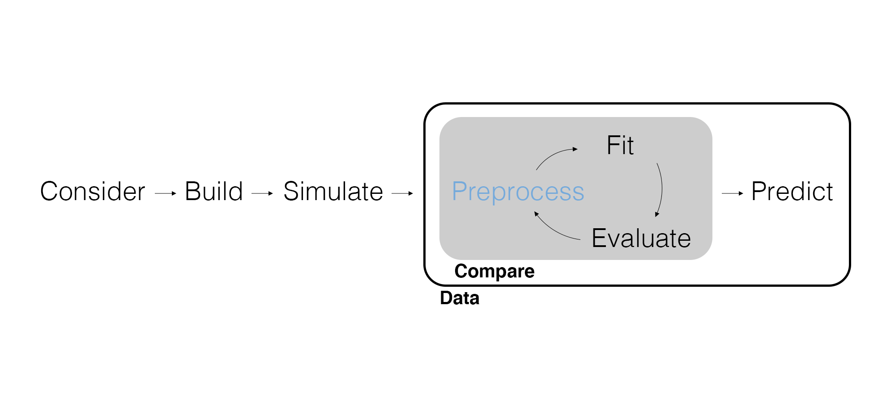

## Marketing Analytics Process

<center>
{width=900px}
</center>

## Inferential Modeling Workflow

<center>
{width=900px}
</center>

---

{width=500px}

## Preprocess Data

So far we have been trying to slowly build intuition about inferential models. Now we want to talk about the data itself. In particular, we often need to **preprocess the data** so it is appropriate for the model to use. This may involve creating new variables as well. This is also known as **feature engineering**. Again, think of *preprocessing* as *data wrangling for models*.

We've technically already done some preprocessing: data splitting.

```{r message=FALSE}
# Load packages.
library(tidyverse)
library(tidymodels)

# Import soup data.
soup_data <- read_csv(here::here("Data", "soup_data.csv"))

# Split data.
soup_split <- initial_time_split(soup_data, prop = 0.90)
```

---

Preprocessing data is made easier using the recipes package where common preprocessing tasks have been broken down into steps, beginning with a `recipe()` where we identify the model outcome and explanatory variables (a.k.a., predictors) using *formula* notation.

```{r}
soup_recipe <- training(soup_split) |> 
  recipe(Sales ~ Any_Disp_Spend + Any_Price_Decr_Spend + Sub_Category)
```
---

```{r}
soup_recipe
```


---

<center>
{width=900px}
</center>

## Right-Skewed Continuous Data

A common problem with data is having **right-skewed continuous data**, something to identify when we're doing *exploratory data analysis*.

Why is right-skewed continuous data common?

```{r eval=FALSE}
# Visualize Sales.
soup_data |> 
  ggplot(aes(x = Sales)) +
  geom_histogram()
```

---

```{r echo=FALSE}
# Visualize Sales.
soup_data |> 
  ggplot(aes(x = Sales)) +
  geom_histogram()
```

---

It's not just `Sales`.

```{r eval=FALSE}
# Visualize all continuous variables.
soup_data |> 
  pivot_longer(
    c(Sales, Any_Disp_Spend, Any_Price_Decr_Spend),
    names_to = "var_names",
    values_to = "cont_values"
  ) |> 
  ggplot(aes(x = cont_values)) +
  geom_histogram() + 
  facet_wrap(~ var_names)
```

---

```{r echo=FALSE}
# Visualize all continuous variables.
soup_data |> 
  pivot_longer(
    c(Sales, Any_Disp_Spend, Any_Price_Decr_Spend),
    names_to = "var_names",
    values_to = "cont_values"
  ) |> 
  ggplot(aes(x = cont_values)) +
  geom_histogram() + 
  facet_wrap(~ var_names)
```

## Pause! Why did the plot report that values were removed?

## Let's Check for Missing Values

```{r}
soup_data |> 
  filter(is.na(Sales) | is.na(Any_Disp_Spend) | is.na(Any_Price_Decr_Spend)) |> 
  select(Sales, Any_Disp_Spend, Any_Price_Decr_Spend)
```

## Plot without Missing Values

```{r echo=FALSE}
# Visualize all continuous variables.
soup_data |> 
  filter(!is.na(Sales), !is.na(Any_Disp_Spend), !is.na(Any_Price_Decr_Spend)) |>
  pivot_longer(
    c(Sales, Any_Disp_Spend, Any_Price_Decr_Spend),
    names_to = "var_names",
    values_to = "cont_values"
  ) |> 
  ggplot(aes(x = cont_values)) +
  geom_histogram() + 
  facet_wrap(~ var_names)
```

---

The linear model assumes *normally distributed errors*. This means our Y variable should be approximately normal (or at least as close as we can get it)! We can preprocess right-skewed continuous data by using a `log()` (i.e., logarithmic) transform.

- Why a `log()` transform? What is a logarithm?
- What is the *inverse* of a logarithm?

```{r eval=FALSE}
# Use the log() transform.
soup_data |> 
  pivot_longer(
    c(Sales, Any_Disp_Spend, Any_Price_Decr_Spend),
    names_to = "var_names",
    values_to = "cont_values"
  ) |> 
  mutate(log_cont_values = log(cont_values + 1)) |> 
  ggplot(aes(x = log_cont_values)) +
  geom_histogram() + 
  facet_wrap(~ var_names, scales = "free")
```

---

```{r echo=FALSE}
# Use the log() transform.
soup_data |> 
  pivot_longer(
    c(Sales, Any_Disp_Spend, Any_Price_Decr_Spend),
    names_to = "var_names",
    values_to = "cont_values"
  ) |> 
  mutate(log_cont_values = log(cont_values + 1)) |> 
  ggplot(aes(x = log_cont_values)) +
  geom_histogram() + 
  facet_wrap(~ var_names, scales = "free")
```

---

We add this step to our recipe using `step_log()`. We can reference all continuous variables in the model with `all_numeric()`. The argument `offset = 1` says to add 1 before using `log()` so we can avoid `log(0)`.

```{r}
soup_recipe <- training(soup_split) |> 
  recipe(Sales ~ Any_Disp_Spend + Any_Price_Decr_Spend + Sub_Category) |> 
  step_log(all_numeric(), offset = 1)

soup_recipe
```

## Discrete Data

How many binary variables will we have when we dummy code this discrete variable?

```{r}
soup_data |> 
  count(Sub_Category)
```

---

We add this step to our recipe using `step_dummy()`. We could reference all discrete variables in the model with `all_nominal()`.

```{r}
soup_recipe <- training(soup_split) |> 
  recipe(Sales ~ Any_Disp_Spend + Any_Price_Decr_Spend + Sub_Category) |> 
  step_log(all_numeric(), offset = 1) |> 
  step_dummy(Sub_Category)

soup_recipe
```

## Prepare a Recipe

We can build the recipe all at once. Once we're ready, we can `prep()` the recipe using the training data. The resulting object is a complete recipe that we can apply to whatever data we'd like.

```{r}
soup_recipe <- training(soup_split) |> 
  recipe(Sales ~ Any_Disp_Spend + Any_Price_Decr_Spend + Sub_Category) |>
  step_log(all_numeric(), offset = 1) |> 
  step_dummy(Sub_Category) |> 
  prep()
```

## Apply a Recipe

Following the recipe analogy, we apply a prepared recipe to data using `bake()`.

```{r}
# Apply the recipe to the training data.
baked_soup_training <- soup_recipe |>
  bake(training(soup_split))

# Apply the recipe to the testing data.
baked_soup_testing <- soup_recipe |>
  bake(testing(soup_split))
```

---

```{r}
baked_soup_training
```

---

```{r}
baked_soup_testing
```

## Fit with Preprocessed Training Data

Let's compare models with and without the preprocessed data.

```{r}
# Fit a model without preprocessed data.
fit_raw <- linear_reg() |> 
  set_engine("lm") |> 
  fit(
    Sales ~ Any_Disp_Spend + Any_Price_Decr_Spend + Sub_Category, 
    data = training(soup_split)
  )

# Fit a model with preprocessed data.
fit_baked <- linear_reg() |> 
  set_engine("lm") |> 
  fit(
    Sales ~ ., 
    data = baked_soup_training
  )
```

## Evaluate Parameter Estimates

If we want to use it, there is a horizontal version of the error bars plot.

```{r eval=FALSE}
# Compare parameter estimates.
tidy(fit_baked, conf.int = TRUE) |> 
  ggplot(aes(y = term)) + 
  geom_point(aes(x = estimate)) + 
  geom_errorbarh(aes(xmin = conf.low, xmax = conf.high), height = .1) +
  geom_vline(xintercept = 0, color = "red")
```

## Error Bar plot for 'Raw' Data

```{r echo=FALSE}
# Compare parameter estimates.
tidy(fit_raw, conf.int = TRUE) |> 
  ggplot(aes(y = term)) + 
  geom_point(aes(x = estimate)) + 
  geom_errorbarh(aes(xmin = conf.low, xmax = conf.high), height = .1) +
  geom_vline(xintercept = 0, color = "red")
```

## Error Bar plot for Pre-processed Data

```{r echo=FALSE}
# Compare parameter estimates.
tidy(fit_baked, conf.int = TRUE) |> 
  ggplot(aes(y = term)) + 
  geom_point(aes(x = estimate)) + 
  geom_errorbarh(aes(xmin = conf.low, xmax = conf.high), height = .1) +
  geom_vline(xintercept = 0, color = "red")
```

---

$$\text{Sales} = 5.42 + 0.12 \times \text{Any_Display_Spend} + \\
... + .18 \times \text{Sub_Category_RTS.SOUP} + ...$$

How does the log transform change parameter interpretations?

- *y* and $x_1$: A **one unit increase** in $x_1$ leads to a **$\beta_1$ unit change** in *y* (relative to the baseline level of $x_1$), holding all other variables fixed.
- log(*y*) and $x_1$: A **one unit increase** in $x_1$ leads to a **100 × $\beta_1$% change** in *y* (relative to the baseline level of $x_1$), holding all other variables fixed.
- *y* and log($x_1$): A **1% increase** in $x_1$ leads to a **$\beta_1$/100 unit change** in *y* (relative to the baseline level of $x_1$), holding all other variables fixed.
- log(*y*) and log($x_1$): A **1% increase** in $x_1$ leads to a **$\beta_1$% change** in *y* (relative to the baseline level of $x_1$), holding all other variables fixed.

## Compute RMSE with Preprocessed Testing Data

```{r}
bind_rows(
  # Compute RMSE without preprocessed testing data.
  predict(fit_raw, new_data = testing(soup_split)) |>
    bind_cols(testing(soup_split)) |>
    rmse(truth = Sales, estimate = .pred),
  # Compute RMSE with preprocessed testing data.
  predict(fit_baked, new_data = baked_soup_testing) |>
    bind_cols(baked_soup_testing) |>
    rmse(truth = Sales, estimate = .pred)
)
```


## Wait...Were the Previous RMSE values Comparable?

## The Model Improved...But not THAT Much

```{r}
bind_rows(
  # Compute RMSE without preprocessed testing data.
  predict(fit_raw, new_data = testing(soup_split)) |>
    bind_cols(testing(soup_split)) |>
    rmse(truth = Sales, estimate = .pred),
  # Compute RMSE for predictions from preprocessed testing data...using the raw Y values
  predict(fit_baked, new_data = baked_soup_testing) |>
    bind_cols(testing(soup_split)) |>
    mutate(.pred = exp(.pred)) |>
    rmse(truth = Sales, estimate = .pred)
)
```

## Apply a Recipe for Prediction

Wait, there's more! Having all of the preprocessing steps saved as a recipe means we can easily apply it to `new_data` when using `predict()` to evaluate counterfactuals. Construct the counterfactual data in the same form as the raw data so that it will work with our recipe.

## Recall the Format of the Raw Data

```{r}
soup_data |>
  select(Any_Disp_Spend, Any_Price_Decr_Spend, Sub_Category, Sales)
```

## Construct Counterfactuals

Allocate $10,000 spend between display and price decreases for each sub-category.

```{r}
# Counterfactual scenarios.
scenarios <- tibble(
  # compute display spend numbers, repeat them 5 times, once for each category
  Any_Disp_Spend = seq(from = 0, to = 10000, by = 2000) |> rep(5),
  # compute price decrease spend numbers, repeat them 5 times, once for each category
  Any_Price_Decr_Spend = seq(from = 10000, to = 0, by = -2000) |> rep(5),
  # character vector of subcategories, repeated six times six we have six counterfactual scenarios
  # in each sub-category
  Sub_Category = unique(soup_data$Sub_Category) |> rep(6) |> sort(),
  Sales = 1
)
```

---

What's different about this `new_data`? How can we interpret each of the rows?

```{r}
scenarios
```

---

Remove the outcome and apply the recipe before using the new data for `predict()`.

```{r}
# Apply the recipe to the training data.
baked_scenarios <- soup_recipe |>
  bake(scenarios) |> 
  select(-Sales)

baked_scenarios
```

---

Generate point predictions and predictive intervals.

```{r}
# Predict and bind on prediction intervals.
bind_cols(
  predict(fit_baked, new_data = baked_scenarios),
  predict(fit_baked, new_data = baked_scenarios, type = "pred_int"),
  baked_scenarios
) |> 
  arrange(desc(.pred))
```

## Other Preprocessing Steps

We can manually wrangle everything that a step function can do, but step functions can be a lot easier to use. Beyond `step_log()` and `step_dummy()`, for example:

- `step_corr()` to check for multicollinearity and drop explanatory variables.
- `step_normalize()` to subtract the mean and divide by the variance.
- `step_discretize()` to make a continuous variable discrete.
- `step_num2factor()` to quickly turn a numeric variable into a factor.

We also have additional helper functions like `all_predictors()`.

## Wrapping Up

*Summary*

- Walked through preprocessing data using recipes.
- Demonstrated the log transform and dummy coding.

*Next Time*

- What if the outcome isn't continuous?

*Supplementary Material*

- *Tidy Modeling with R* Chapter 8

*Artwork by @allison_horst*

## Exercise 13

Return again to `soup_data` and your models used in Exercises 11 and 12.

1. Check for right-skewed continuous variables.
2. Prepare a recipe using the necessary steps.
3. Fit the models again on the preprocessed training data.
4. Compute the RMSE again using the preprocessed testing data. Is the same model as last time still the best-fitting model?
5. Use the best-fitting model (based on RMSE) and predict `Sales` using three possible ways to split $6000 for the promotions budget. As with the training and testing data, be sure to preprocess the new data. What should the client do with their promotional budget? Provide an interpretation using dollars.
6. Render the Quarto document into Word and upload to Canvas.

